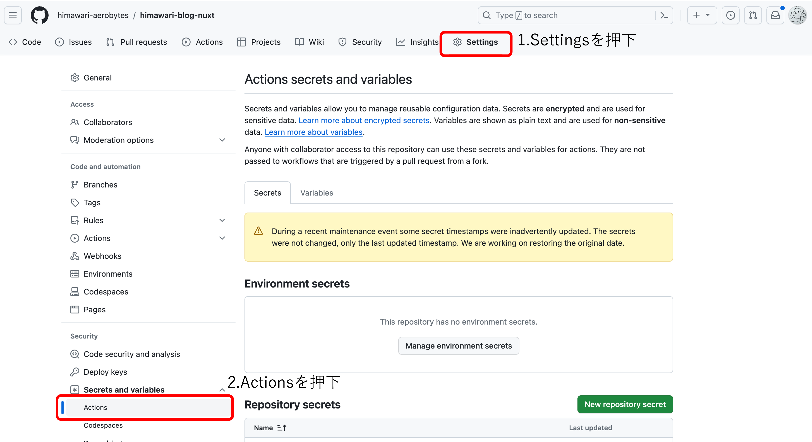
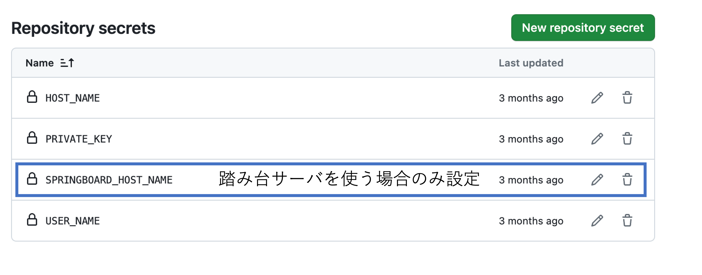

# GitHubActions設定手順書
本手順書は、GitHubActionsの設定を示す。

## GitHub上の設定
1. GitHubに接続しプロジェクトのSettingsに移動する。

2. 以下のSecretを設定する。


```
HOST_NAME:サーバのIPアドレス
PRIVATE_KEY:サーバのSSHキー
USER_NAME:サーバのユーザ名
```

上記の設定は、.github/workflows/deploy.ymlで参照されている。
踏み台サーバが必要な場合は、上記ファイルのjobs.build.steps.withに以下を追加する。

```
proxy_host: ${{ secrets.SPRINGBOARD_HOST_NAME }}
proxy_username: ${{ secrets.USER_NAME }}
proxy_key: ${{ secrets.PRIVATE_KEY }}
```

踏み台サーバのUSER_NAMEとPRIVATE_KEYがサーバと異なる場合、GitHubのSecretに追加する（手順２参照）。また、`${{ secrets.USER_NAME }}`と`${{ secrets.PRIVATE_KEY }}`も適当な名前に修正する。

